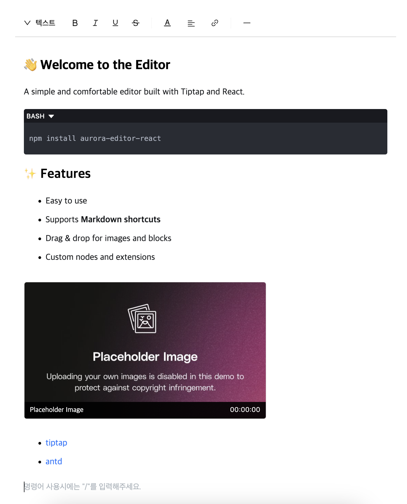

# Aurora Editor

Aurora Editor is a rich text editor component for React based on Tiptap and Ant Design. It provides an easy-to-use interface with extensible features.

## Features

-   **Various text formatting**: Bold, italic, underline, strikethrough, and other basic text formatting
-   **Block elements**: Headings, blockquotes, code blocks, horizontal rules
-   **Color and highlighting**: Text color changes and background highlighting
-   **Alignment options**: Left, center, right, justify
-   **Lists**: Ordered lists, unordered lists, checklists
-   **Media insertion**: Insert images, YouTube videos
-   **Code blocks**: Code blocks with syntax highlighting (supporting over 20 languages)
-   **Links**: URL link insertion and management
-   **Interactive UI features**:
    -   **Tooltip**: Hover tooltips on toolbar buttons for better UX
    -   **Bubble menu**: Context-sensitive formatting menu that appears on text selection
-   **Other features**: Text indentation and more

## Installation

```bash
npm install aurora-editor-react
# or
yarn add aurora-editor-react
```



## Usage

```tsx
import { useRef } from 'react';
import { AuroraEditor, AuroraEditorHandle } from 'aurora-editor';
import { AuroraToolbar } from 'aurora-editor/components/toolbar';
import { AuroraTextarea } from 'aurora-editor/components/textarea';
import { Button, Flex } from 'antd';

function MyEditor() {
    const editorRef = useRef<AuroraEditorHandle>(null);

    return (
        <>
            <AuroraEditor
                ref={editorRef}
                initContent="<p>Hello Aurora!</p>"
                placeholder="Type '/' to use commands."
                tooltip={true}
                bubble={true}
                onUpdate={handleUpdate}
            >
                <AuroraToolbar />
                <AuroraTextarea />
            </AuroraEditor>
        </>
    );
}
```

## API Reference

### AuroraEditor Props

| Prop          | Type                     | Description                                                   |
| ------------- | ------------------------ | ------------------------------------------------------------- |
| `children`    | `ReactNode`              | Child elements to add to the editor (e.g., toolbar, textarea) |
| `initContent` | `string`                 | Initial HTML content of the editor                            |
| `placeholder` | `string`                 | Placeholder text                                              |
| `tooltip`     | `boolean`                | Enable tooltips on toolbar buttons (default: true)            |
| `bubble`      | `boolean`                | Enable bubble menu on text selection (default: false)         |
| `onUpdate`    | `(html: string) => void` | Callback function called when content changes                 |

### AuroraEditorHandle Methods

| Method          | Return Type | Description                              |
| --------------- | ----------- | ---------------------------------------- |
| `focus`         | `void`      | Sets focus on the editor                 |
| `getHTML`       | `string`    | Returns editor content as an HTML string |
| `getJSON`       | `object`    | Returns editor content as a JSON object  |
| `setContent`    | `void`      | Sets the editor content                  |
| `setClear`      | `void`      | Clears the editor content                |
| `insertContent` | `void`      | Insert content into the editor           |

## Tooltip & Bubble Menu

### Tooltip

Tooltips provide contextual information about each toolbar button when users hover over them. This feature helps improve usability by explaining button functions.

-   Tooltips are enabled by default
-   You can disable tooltips by setting `tooltip={false}`
-   Tooltips use Ant Design's Tooltip component for consistent styling

### Bubble Menu

The bubble menu is a floating formatting menu that appears when text is selected. It provides quick access to common formatting options right where you need them.

-   The bubble menu is disabled by default
-   Enable it by setting `bubble={true}`
-   The menu appears only on text selection and not on special elements like images, code blocks, and YouTube embeds
-   Provides quick access to common text formatting options without moving to the toolbar

## License

MIT
